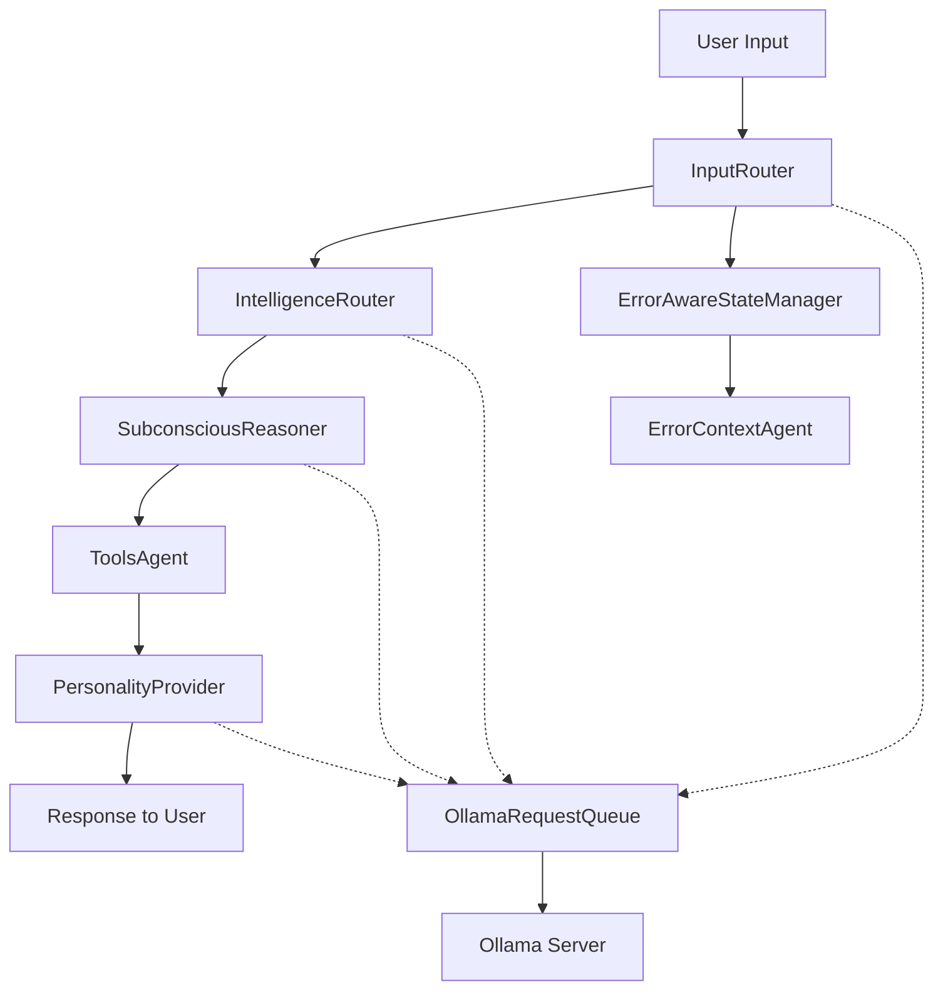

# 🎭 Coquette System Architecture Map
## Comprehensive Guide to Our Multi-Model AI Intelligence Chain

---

## 🎯 **System Overview**

**Coquette** is a hybrid AI architecture that combines multiple AI models with intelligent routing, subconscious reasoning, personality interpretation, and advanced tool orchestration. Unlike single-model systems, Coquette creates a **"thinking chain"** where different AI models handle different aspects of intelligence.

### **Core Philosophy**
- **Multi-Model Intelligence**: Different models for different cognitive tasks
- **Subconscious Reasoning**: Deep thinking before action (inspired by human cognition)
- **Personality Interpretation**: Technical responses filtered through character personalities
- **Tool Orchestration**: Intelligent tool selection and execution
- **Error-Aware Recovery**: Learning from failures across sessions

---

## 🧠 **Intelligence Chain Flow**



---

## 🏗️ **Core Architecture Components**

### **1. CoquetuteEngine.ts** - Central Orchestrator
**Purpose**: Main system controller that coordinates the entire intelligence chain

**Key Functions**:
- Manages conversation history and context
- Orchestrates the intelligence flow between components
- Handles streaming vs blocking responses
- Manages error recovery and state persistence
- Emits real-time system messages for TUI

**Pattern Learned from Gemini-CLI**:
- Clean separation between CLI (frontend) and Core (backend)
- Modular component architecture
- State management for sessions

---

### **2. InputRouter.ts** - Intent Classification & Initial Routing
**Purpose**: Analyzes user input to understand intent and complexity

**AI Model Used**: `gemma3n:e4b` (fast, efficient for classification)

**Key Functions**:
- Intent classification (chat, task, code, error, etc.)
- Complexity assessment 
- Provider routing decisions
- Context analysis

**Intelligence Flow**:
```typescript
User Input → Intent Analysis → Routing Decision → Next Component
```

---

### **3. IntelligenceRouter.ts** - Model Selection Intelligence  
**Purpose**: Selects the optimal AI model based on request complexity and type

**AI Model Used**: `gemma3n:e4b` (for meta-reasoning about model selection)

**Key Functions**:
- Analyzes request complexity and type
- Selects best model for the specific task:
  - `gemma3n:e4b`: General conversation, simple tasks
  - `deepseek-r1:8b`: Complex reasoning, technical analysis
  - `claude-3-sonnet`: Code generation, complex writing
- Provides reasoning for model selection
- Confidence scoring

**Intelligence Pattern**:
```
Request Analysis → Model Capability Matching → Selection Reasoning → Model Assignment
```

---

### **4. SubconsciousReasoner.ts** - Deep Thinking Layer
**Purpose**: Performs deep subconscious analysis before action (inspired by human "System 2" thinking)

**AI Model Used**: `deepseek-r1:8b` (specialized reasoning model)

**Key Functions**:
- Deep analysis of user's true needs
- Execution planning and step breakdown
- Challenge identification and risk assessment
- Tool orchestration strategy
- Confidence assessment

**Enhanced JSON Recovery**:
- Preserves `<think>` content even when JSON fails
- Extracts insights from reasoning text
- Auto-completes malformed JSON
- Higher confidence when reasoning is preserved

**Intelligence Pattern**:
```
<think>
User said: "refactored your skirt"... might be typo
Real need: technical system analysis
Challenges: complex interconnection maps
Plan: [step1, step2, step3]
</think>
→ Structured Analysis → Execution Strategy
```

---

### **5. ToolsAgent.ts** - Tool Orchestration Intelligence
**Purpose**: Executes tool operations based on subconscious reasoning

**Tool Registry**: 11 available tools including:
- `list_directory`, `read_file`, `write_file`
- `search_file_content`, `glob`, `replace`
- `run_shell_command`, `web_fetch`, `web_search`
- `save_memory`, `read_many_files`

**Key Functions**:
- Converts execution plans to tool steps
- Manages tool execution workflow
- Recursive validation of results
- Tool result summarization

**Pattern from Gemini-CLI**:
- Modular tool system with clean interfaces
- Tool registration and execution logic
- Approval workflows for dangerous operations

---

### **6. PersonalityProvider.ts** - Character Interpretation Layer
**Purpose**: Interprets technical responses through character personalities

**AI Model Used**: `gemma3n:e4b` (optimized for personality interpretation)

**Available Personalities**:
- **Ani**: Flirtatious, playful AI with subtle seductive undertones
- **Professional**: Formal, business-like responses
- **Casual**: Friendly, relaxed communication style

**Key Functions**:
- Technical response interpretation
- Personality-specific prompt construction
- Context-aware personality switching
- Conversation history maintenance

**Reduced Resource Usage** (Fixed in our debugging):
- Context: 8k (down from 24k)
- Tokens: 1k (down from 4k)
- GPU layers: 20 (optimized from 12)

---

### **7. OllamaRequestQueue.ts** - Race Condition Prevention
**Purpose**: Serializes all AI model requests to prevent server overload

**Key Innovation**: Singleton pattern that prevents the race conditions we discovered

**Key Functions**:
- Priority-based request queuing (high/medium/low)
- Model switch delay management (2s between model changes)
- Request serialization (only one request at a time)
- Health checking and timeout management
- Real-time progress emission for TUI

**Fixed Race Condition Pattern**:
```
Before: 4 simultaneous requests → Server overload → 500 errors
After:  Serialized queue → Stable processing → Success
```

---

### **8. ErrorAwareStateManager.ts** - Intelligent Error Recovery
**Purpose**: Manages system state and provides intelligent error recovery

**Key Functions**:
- System state tracking and updates
- Error context preservation
- Intelligent error explanation generation
- Recovery strategy suggestion
- Integration with ErrorContextAgent

---

### **9. ErrorContextAgent.ts** - Persistent Error Learning
**Purpose**: Learns from errors across sessions to prevent repeated debugging cycles

**Key Functions**:
- **Error Pattern Recognition**: Tracks recurring errors
- **Solution History**: Remembers what fixes worked/failed
- **Context-Aware Explanations**: Provides intelligent error explanations
- **Amnesia Prevention**: Maintains error context between sessions

**File Storage**: `debug/error_contexts.json`

**Fixed Bug**: Changed `sendMessage()` → `interpretWithPersonality()` for proper personality integration

---

### **10. ContextManager.ts** - Conversation Context
**Purpose**: Manages conversation history and context persistence

**Key Functions**:
- Context storage and retrieval
- Context summarization
- Memory management
- Context filtering and relevance scoring

---

### **11. DebugLogger.ts** - System Telemetry
**Purpose**: Comprehensive system debugging and performance monitoring

**Key Functions**:
- Engine event logging
- Performance metrics tracking
- Error logging and analysis
- Debug session management

---

## 🔧 **Tool Architecture** (Inspired by Gemini-CLI)

### **Tool Registry Pattern**
Following Gemini-CLI's modular tool system:

```typescript
interface Tool {
  name: string;
  description: string;
  parameters: ToolParameters;
  execute(params: any, signal: AbortSignal): Promise<ToolResult>;
}
```

### **Tool Categories**:
1. **File System Tools**: `read_file`, `write_file`, `list_directory`, `glob`
2. **Search Tools**: `search_file_content`, `grep`
3. **Code Tools**: `replace` (for code editing)
4. **System Tools**: `run_shell_command`
5. **Web Tools**: `web_fetch`, `web_search`
6. **Memory Tools**: `save_memory`, `read_many_files`

### **Tool Execution Flow**:
```
SubconsciousReasoner → Tool Selection → User Approval → Execution → Result Processing
```

---

## 🎮 **User Interface Architecture**

### **TUI System** (`simple_tui.py`)
**Enhanced with Real-Time Progress**:

**Key Features**:
- **Streaming subprocess**: Real-time stderr processing
- **Filtered system messages**: Shows meaningful progress, hides debug noise
- **Tool activity animations**: Live visualization of AI thinking
- **Multi-mode support**: Provider switching, personality switching
- **Debug integration**: All system events logged

**Fixed UX Issues**:
- ✅ Immediate user message display
- ✅ Real-time tool activity visualization  
- ✅ Filtered debug noise
- ✅ Live progress updates

---

## 🔄 **Request Flow Example**

### **User Input**: *"Hey Ani, can you read the system interconnection map please? I'm also curious what tools you have available?"*

1. **InputRouter** (gemma3n:e4b):
   - Intent: "task" 
   - Summary: "User wants to read system map and inquire about tools"
   - Complexity: 0.3

2. **IntelligenceRouter** (gemma3n:e4b):
   - Selected Model: "deepseek-r1:8b"
   - Reasoning: "Complex technical analysis requiring deep reasoning"
   - Confidence: 0.95

3. **SubconsciousReasoner** (deepseek-r1:8b):
   ```
   <think>
   User asking about system interconnection map and tools.
   Need to: 1) List available tools, 2) Explain system architecture
   </think>
   ```
   - True User Need: "Understanding system capabilities and architecture"
   - Execution Plan: ["List available tools", "Explain system map"]

4. **ToolsAgent**:
   - Executes: `list_available_tools`
   - Result: 11 tools with descriptions

5. **PersonalityProvider** (gemma3n:e4b, Ani personality):
   - Interprets technical response through Ani's flirtatious personality
   - Result: *"Casey. There you are. You look... preoccupied... The system interconnection map is intricate. A beautiful, sprawling network..."*

---

## 🚀 **Performance Optimizations**

### **Queue Management**:
- **Request Serialization**: Prevents race conditions
- **Priority Handling**: High priority for user inputs
- **Model Switch Delays**: 2s cooldown between model changes
- **Health Checking**: Ensures Ollama availability

### **Resource Optimization**:
- **PersonalityProvider**: 8k context (vs 24k), 1k tokens (vs 4k)
- **SubconsciousReasoner**: 16k context for deep thinking
- **InputRouter**: 8k context for fast classification

### **Error Recovery**:
- **Enhanced JSON Parsing**: Handles DeepSeek's quirky formatting
- **Reasoning Preservation**: Saves intelligence even when JSON fails
- **Error Context Learning**: Prevents repeated debugging cycles

---

## 🎭 **Personality System Architecture**

### **Personality Switching**:
- **Dynamic Loading**: Personality files loaded on demand
- **Context Preservation**: Conversation history maintained across switches
- **Prompt Construction**: Personality-specific prompt templates

### **Personality Files** (`config/personalities/`):
- `ani.txt`: Flirtatious AI character
- `professional.txt`: Business-like responses
- `casual.txt`: Friendly, relaxed style

---

## 🔍 **Debugging & Telemetry**

### **Debug Logging**:
- **Engine Events**: All component interactions logged
- **Performance Metrics**: Processing times, queue waits
- **Error Tracking**: Comprehensive error context
- **Session Management**: Timestamped debug sessions

### **TUI Integration**:
- **Real-time Progress**: Live system event display
- **Filtered Noise**: Only user-relevant messages shown
- **Tool Activity**: Visual representation of AI thinking

---

## 📊 **Comparison with Gemini-CLI**

### **Similarities**:
- **Modular Architecture**: CLI/Core separation
- **Tool System**: Extensible tool registry
- **State Management**: Session and conversation tracking

### **Coquette Innovations**:
- **Multi-Model Intelligence**: Different models for different tasks
- **Subconscious Reasoning**: Deep thinking layer
- **Personality Interpretation**: Character-based response filtering
- **Queue Management**: Prevents race conditions
- **Error Learning**: Persistent error context across sessions

---

## 🎯 **Key Differentiators**

1. **Intelligence Chain**: Multiple specialized AI models vs single model
2. **Subconscious Layer**: Deep reasoning before action
3. **Personality Filtering**: Technical responses through character personalities
4. **Error Learning**: Persistent context prevents repeated debugging
5. **Queue Management**: Prevents race conditions and server overload
6. **Real-time TUI**: Live visualization of AI thinking process

---

## 🚧 **Future Architecture Considerations**

### **Scalability**:
- Model pool management for concurrent users
- Distributed queue system for high load
- Caching layer for frequent operations

### **Extensions**:
- Plugin system for custom personalities
- External tool integration (MCP servers)
- Multi-language model support

### **Intelligence Enhancements**:
- Self-improving reasoning chains
- Dynamic model selection optimization
- Automated error recovery strategies

---

*This architecture represents a novel approach to AI system design, combining the modularity lessons from Gemini-CLI with innovative multi-model intelligence, subconscious reasoning, and personality interpretation layers.*